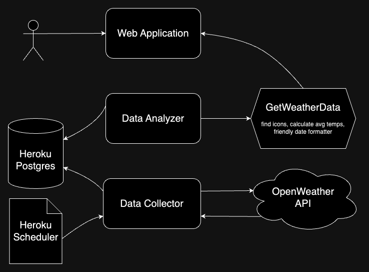
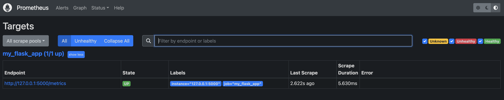
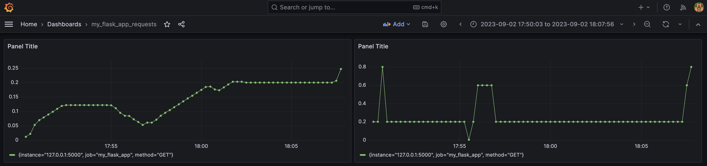
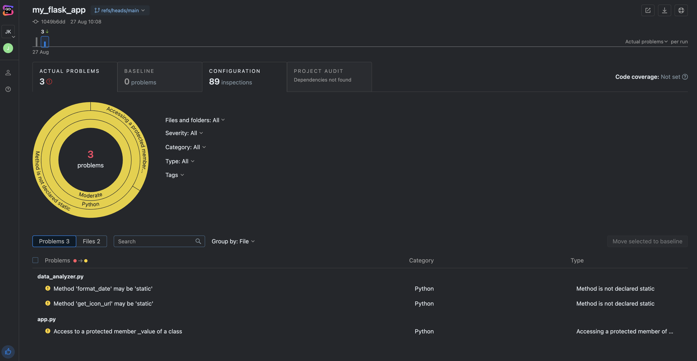

# 3-Day Weather Forecast App

The **3-Day Weather Forecast App** is a Flask-based web application that
fetches and displays weather forecast data for different cities. It
leverages the OpenWeatherMap API to gather weather information and presents
it in a user-friendly format.

## Active Deployment

A running version of this application can be
reached at https://my-flask-app-cub-7c3633e922e1.herokuapp.com/. Please
note that regular Heroku maintenance could change secrets that may need to
be updated - and Postgres may be taken down to save on monthly fees at any
time.

## High Level Architecture Diagram



## Features

- Fetches weather forecast data from the OpenWeatherMap API.
- Displays 3-day weather forecasts for the cities of Denver and Boulder.
- Calculates and displays the average temperature for each city.
- Provides Prometheus metrics for monitoring the app's request rate.

## Installation

1. Clone the repository
2. Navigate to the project directory
3. Create a virtual environment: \
   `python3 -m venv venv`
4. Activate the virtual environment: \
   `source venv/bin/activate`
5. Install the required Python packages using pip: \
   `pip install -r requirements.txt`
6. (Running Locally) - Set up a .env file containing 'DATABASE_URL' and
   'OPENWEATHERMAP_API_KEY'
   environment variables

## Usage

1. Run the Flask app: \
   `python -m applications.frontend.app`
2. Access the app in your web browser at `http://localhost:5000`.
3. The app's main page will display 3-day weather forecasts for Boulder and
   Denver, including temperature, humidity, and weather description.
4. The `/health` endpoint provides a health check response of "200 OK".
5. The `/metrics` endpoint provides Prometheus metrics, including the
   number of requests per second since the app started.

## Endpoints

- `/health`: Returns "200 OK" as a health check response.
- `/metrics`: Returns Prometheus metrics, including the number of requests per
  second and other relevant metrics.

## Deployment

This project is deployed on Heroku. Heroku was chosen for its extreme ease
of deployment through GitHub actions and user interface. It also provides a
very simple Heroku Postgres and Heroku Scheduler for integrating solutions
in one place.

## Monitoring

For monitoring the app's performance, you can configure Prometheus to
scrape the `/metrics` endpoint for metrics data. The app provides
information on requests per second and other relevant metrics. Grafana can
be used to visualize the data collected by Prometheus.
`http_requests_per_second_total` is a representation of requests over time.

Example of `prometheus.yaml` (local):

```
global:
  scrape_interval: 15s

scrape_configs:
  - job_name: 'my_flask_app'
    metrics_path: '/metrics'
    scrape_interval: 5s
    scheme: http
    static_configs:
      - targets: [ '127.0.0.1:5000' ]
```

Example of `prometheus.yaml` (Heroku):

```
global:
  scrape_interval: 15s

scrape_configs:
  - job_name: 'my_flask_app'
    metrics_path: '/metrics'
    scrape_interval: 5s
    scheme: https
    static_configs:
      - targets: [ 'my-flask-app-cub-7c3633e922e1.herokuapp.com' ]

```

Example Grafana metric query: \
`irate(http_requests_per_second_total[5m])` \
or \
`rate(http_requests_per_second_total[5m])`

### Prometheus Dashboard Example


### Grafana Dashboard Example


## Code Analysis

This application uses Qodana for code analysis. An example of the Qodana
code analysis dashboard can be found below.



## Acknowledgements

This app was built using Flask, OpenWeatherMap API, and Prometheus.
Deployment is on Heroku and uses Scheduler and Postgres hosted there. Special
thanks to the creators and maintainers of these tools.
